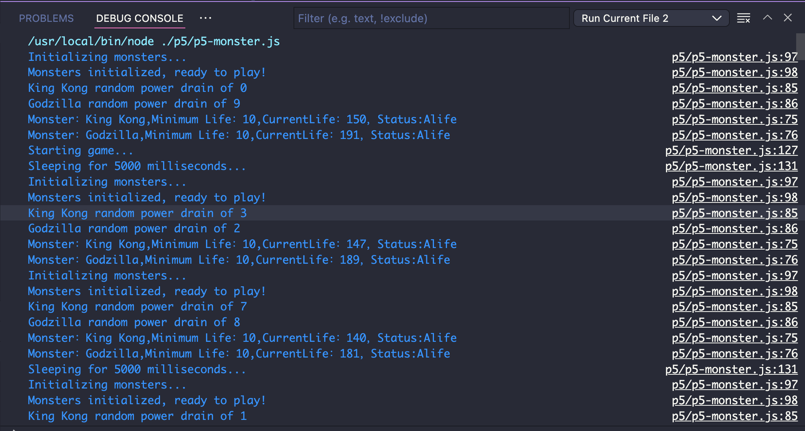

Project-5

This project is an extra credit project.
Honely, I have spent a lot of time on this project. I have tried to do it. I have most of the output of what it required, but I still recieved 0 point for it, which is really disappointed :(

This project we are trying to develop a game. 
We have to practice the construction method, switch statement, Array map() and forEach() methods.  

Here is a output of my monster game 

